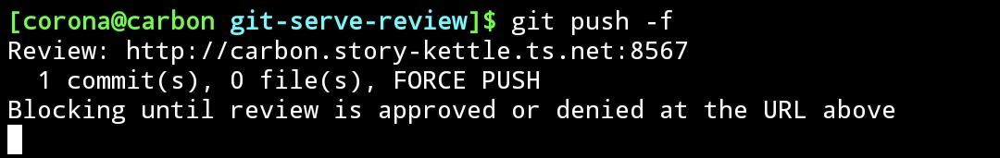
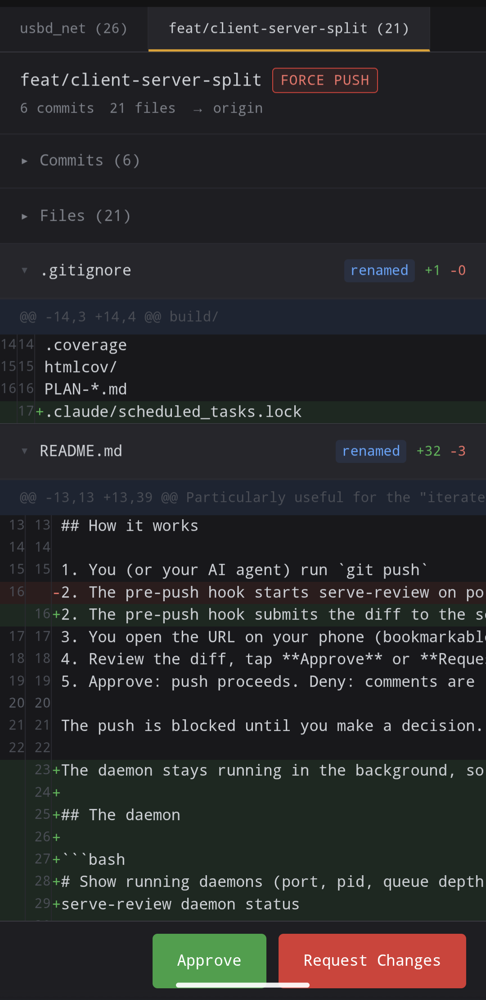
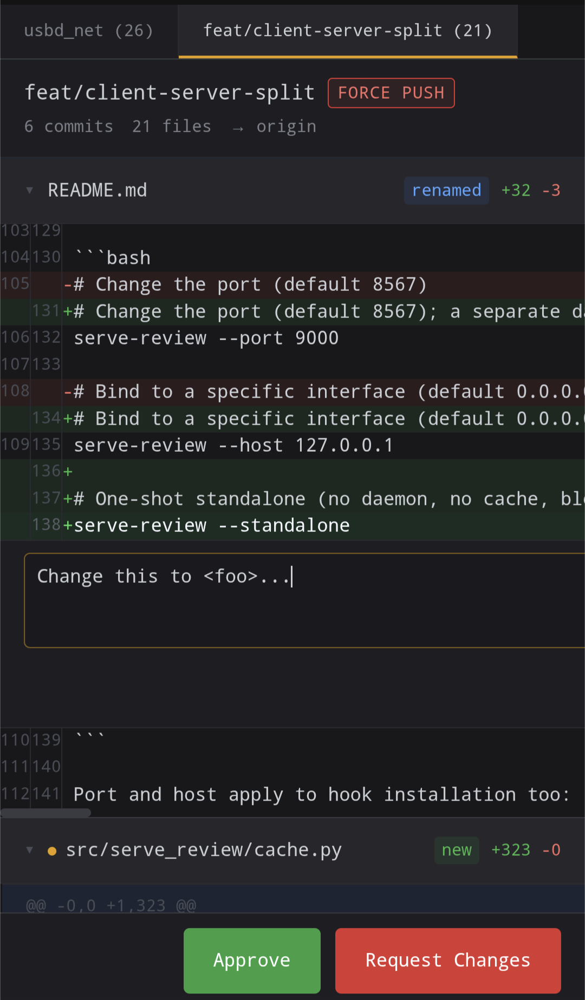

# serve-review

A pre-push hook that pauses `git push` so the developer can review the change in a web UI, then approve, or deny with targeted feedback. When the push was initiated by an AI agent, the denial feedback is returned as structured JSON the agent reads automatically and acts on.

## Why this exists

I had an AI coding agent fabricate a copyright attribution ("Copyright (c) 2022 Blake W. Garner") in a commit that got pushed to a public upstream repo under my name. The maintainer asked "Who is Blake Garner??" and trust was damaged. The agent had invented the name from nothing, buried it in a license header, and I'd approved the push without reading the diff.

Claude Code gives you a permission prompt before `git push`, but it doesn't show the actual diff. You're approving blind. serve-review fills that gap: it serves the diff on a static port so you can review on your phone, tablet, or any device on your network before the push goes through.

Particularly useful for the "iterate and force-push" workflow on existing PRs, where subsequent changes bypass the initial draft-PR review.

## How it works

1. You (or your AI agent) run `git push`.

2. The pre-push hook submits the diff to the serve-review daemon (auto-spawned the first time) and prints the review URL. The push is paused on this line until a decision arrives:

   

3. You open the URL on any device on your network: phone, tablet, laptop. The page is bookmarkable and installable as a PWA. When multiple repos push concurrently, each review is its own tab:

   

4. Read the diff, tap a line to leave a comment, then **Approve** or **Request Changes**:

   

5. Approve: the push proceeds. Deny: the push is blocked, your line comments and overall message are returned as structured JSON. An AI agent that initiated the push reads that JSON directly and acts on each comment without further prompting.

The daemon stays running in the background, so multiple repos can submit reviews simultaneously and you'll see them as separate tabs in the UI. Approved decisions are cached for 48 hours: if you re-push the same diff content (e.g. after a rebase that doesn't change any lines), the result is replayed instantly without re-prompting.

## The daemon

```bash
# Show running daemons (port, pid, queue depth, URL)
serve-review daemon status

# Stop a daemon (defaults to port 8567)
serve-review daemon stop
serve-review daemon stop --port 9000
serve-review daemon stop --all

# Start in foreground (mostly for debugging)
serve-review daemon start
```

State lives in `~/.cache/serve-review/`:
- `daemon-{port}.pid` — one per running daemon
- `decisions/{hash}.json` — cached approve/deny decisions, swept after 48h
- `daemon.log` — uvicorn output, truncated on restart if over 10 MiB

By default the daemon binds to `0.0.0.0` so devices on your local network or Tailnet can reach it. The trust boundary is your network — there is no auth layer. Pass `--host 127.0.0.1` to bind loopback only.

If the daemon can't be reached for any reason, the hook falls back to a one-shot standalone server on the same port (or an ephemeral one if the port is taken). The `--standalone` flag bypasses the daemon entirely.

## Install

```bash
uv tool install serve-review

# or with pip
pip install serve-review
```

## Setup

### Git pre-push hook (per repo)

```bash
serve-review install-hook
```

Installs a pre-push hook in `.git/hooks/pre-push`. Every `git push` in that repo requires review.

If you already have a pre-push hook (from pre-commit or otherwise), use `--force` to chain them:

```bash
serve-review install-hook --force
```

This backs up your existing hook to `pre-push.original` and creates a wrapper that runs your original hook first, then serve-review on success. To undo:

```bash
serve-review uninstall-hook
```

### pre-commit framework

If you use the [pre-commit](https://pre-commit.com/) framework:

```bash
serve-review pre-commit-config
```

Prints a YAML snippet for `.pre-commit-config.yaml`. Then:

```bash
pre-commit install --hook-type pre-push
```

### Claude Code hook

Intercepts `git push` commands the agent attempts via a `PreToolUse` hook:

```bash
# Project-level (.claude/settings.json)
serve-review install-claude-hook

# User-wide (~/.claude/settings.json)
serve-review install-claude-hook --global
```

### Manual

```bash
# Diff current branch against the default branch
serve-review

# Diff between specific refs
serve-review --base origin/main --head HEAD
```

## The review UI

Dark-themed, mobile-first diff viewer on port 8567. Bundled Prism.js for syntax highlighting.

- Unified diff with collapsible file sections
- Commit list with full messages, click to filter diff to one commit's files
- Attention flags: added lines containing email addresses, URLs, copyright text, author attributions, or license keywords get an amber highlight. A banner links to the first flagged line
- Line-level inline comments, similar to GitHub's review UI
- Approve / Request Changes buttons in a fixed bottom bar

Installable as a PWA on Android Chrome. Static port means you can pin it to your home screen and it stays at the same address.

## Configuration

```bash
# Change the port (default 8567); a separate daemon runs per port
serve-review --port 9000

# Bind to a specific interface (default 0.0.0.0; trust boundary is your network)
serve-review --host 127.0.0.1

# One-shot standalone (no daemon, no cache, blocks the calling process)
serve-review --standalone
```

Port and host apply to hook installation too:

```bash
serve-review install-claude-hook --port 9000
```

## Denial output

When you deny, comments are written to stdout as JSON. An AI agent that called `git push` sees this in the hook's output and uses it directly; there's no separate plumbing to wire up.

```json
{
  "decision": "deny",
  "overall_comment": "The copyright attribution on line 1 is fabricated",
  "comments": [
    {
      "body": "This name doesn't exist in the project, remove it",
      "file": "lib/header.h",
      "line": 1
    }
  ]
}
```

A human-readable summary of the same content goes to stderr.

## Development

```bash
git clone https://github.com/andrewleech/serve-review.git
cd serve-review
uv sync
uv run pytest -v
uv run ruff check src/ tests/
uv run mypy src/
```
